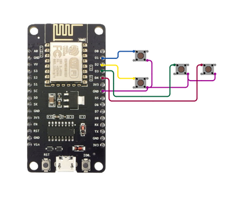

# ESP-NOW Remote Control Project

This project implements a wireless remote control system using ESP8266 microcontrollers and the ESP-NOW protocol. It consists of a transmitter (controller) and a receiver (robot or device being controlled).

## Table of Contents

- [Features](#features)
- [Hardware Requirements](#hardware-requirements)
- [Software Requirements](#software-requirements)
- [Setup](#setup)
- [Configuration](#configuration)
- [Usage](#usage)
- [Circuit Diagrams](#circuit-diagrams)
- [Troubleshooting](#troubleshooting)
- [Contributing](#contributing)
- [Credits](#credits)

## Features

- Wireless communication using ESP-NOW protocol
- Four-button control system
- 8 directional movements (forward, backward, left, right, and diagonals)
- Motor control for a two-wheeled / four-wheeled car or similar device

## Hardware Requirements

- 2 x ESP8266 boards (e.g., NodeMCU)
- 4 x Push buttons
- 2 x DC motors (for the receiver/car)
- L298N Motor Driver (or similar)
- Power supply for the motors
- Jumper wires

## Software Requirements

- Arduino IDE
- ESP8266 board support for Arduino IDE
- ESP8266WiFi library
- espnow library

## Setup

1. Install the required libraries in your Arduino IDE.
2. Upload the `transmitter.ino` code to one ESP8266 board (the controller).
3. Upload the `receiver.ino` code to another ESP8266 board (the robot).
4. Connect the buttons to the transmitter board according to the pin definitions in the code.
5. Connect the motors and motor driver to the receiver board as per the pin definitions.

## Configuration

Before uploading the code:

1. In `transmitter.ino`, replace the `receiverMAC` array with the MAC address of your receiver ESP8266.
2. Adjust the `SERIAL_PORT` boolean in both files if you want to enable/disable serial debugging.

## Usage

1. Power on both the transmitter and receiver.
2. Press the buttons on the transmitter to control the movement of the receiver (robot).
3. The receiver will interpret the button presses and control the motors accordingly.

## Circuit Diagram

## Troubleshooting

- Ensure both devices are powered and within range of each other.
- Check that the MAC address in the transmitter code matches the receiver's MAC address.
- Verify all connections if the motors are not responding as expected.

## Contributing

Contributions to improve the project are welcome. Please feel free to fork the repository and submit pull requests.

## Credits

Created by NIHAL T P
GitHub: [nihaltp](https://github.com/nihaltp)