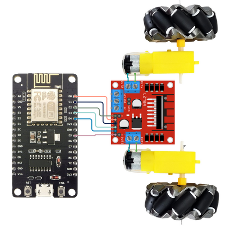

# ESP-NOW Remote Control Project

This project implements a wireless remote control system using ESP8266 microcontrollers and the ESP-NOW protocol. It consists of a transmitter (controller) and a receiver (robot or device being controlled).

## Table of Contents

- [Features](#features)
- [Hardware Requirements](#hardware-requirements)
- [Software Requirements](#software-requirements)
- [Setup](#setup)
- [Configuration](#configuration)
- [Usage](#usage)
- [Circuit Diagrams](#circuit-diagram)
- [Troubleshooting](#troubleshooting)

## Features

- Wireless communication using ESP-NOW protocol
- Four-button control system
- 8 directional movements (forward, backward, left, right, and diagonals)
- Motor control for a two-wheeled / four-wheeled car or similar device

## Hardware Requirements

- 2 x ESP8266 boards or ESP32 boards
- 4 x Push buttons
- 2 x DC motors (for the receiver/car)
- Motor Driver
- Power supply for the motors
- Jumper wires

## Software Requirements

- Arduino IDE
- ESP8266/ESP32 board support for Arduino IDE
- ESP8266WiFi/WiFi library
- espnow/esp_now library

## Setup

1. Install the required libraries in your Arduino IDE.
2. Upload the [`transmitter.ino`](transmitter/transmitter.ino) code to one ESP8266/ESP32 board (the controller).
3. Upload the [`receiver.ino`](receiver/receiver.ino) code to another ESP8266/ESP32 board (the robot).
4. Connect the GND to button inputs
5. Connect the buttons to the transmitter board according to the pin definitions in the code.
6. Connect the motors and motor driver to the receiver board as per the pin definitions.

## Configuration

Before uploading the code:

1. In [`transmitter.ino`](transmitter/transmitter.ino), replace the [`BOARD`](transmitter/transmitter.ino#L13) variable to match your transmitter ESP Board type.
2. In [`transmitter.ino`](transmitter/transmitter.ino), replace the [`receiverMAC`](transmitter/transmitter.ino#L32) array with the MAC address of your receiver ESP.
3. In [`receiver.ino`](receiver/receiver.ino), adjust the [`BOARD`](receiver/receiver.ino#L17) variable to match your ESP Board type.
4. In [`receiver.ino`](receiver/receiver.ino), adjust the [`MOTOR_DRIVER`](receiver/receiver.ino#L18) variable to match your motor driver type.
5. Adjust the `SERIAL_PORT` boolean in both files if you want to enable/disable serial debugging.
6. Adjust & Verify the pin assignments for [`transmitter`](transmitter/transmitter.ino#L40-L48).
7. Adjust & Verify the pin assignments for [`receiver.ino`](receiver/receiver.ino#L36-L62).

## Usage

1. Power on both the transmitter and receiver.
2. Press the buttons on the transmitter to control the movement of the receiver (robot).
3. The receiver will interpret the button presses and control the motors accordingly.

## Circuit Diagram

### For ESP8266:

## Troubleshooting

- Ensure both devices are powered and within range of each other.
- Check that the MAC address in the transmitter code matches the receiver's MAC address.
- Verify all connections if the motors are not responding as expected.
- Make sure GND is provided to Buttons
